数据可视化教程
=========================

PowerBI数据可视化入门教程
---------------------------------

**【PowerBI入门教程】01前言**

----

**【PowerBI入门教程】02介绍**

----

**【PowerBI入门教程】03软件安装**

----

**【PowerBI入门教程】04软件界面介绍**

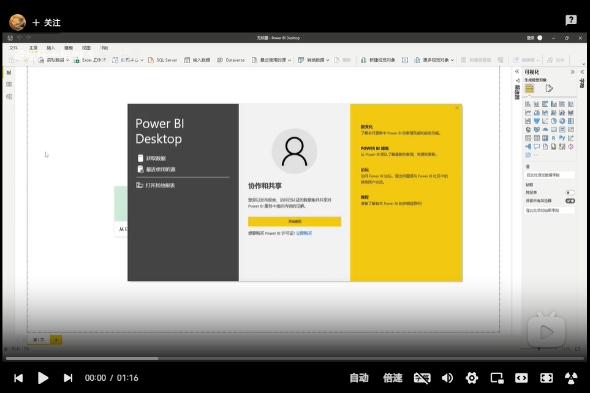

----

**【PowerBI入门教程】05数据导入**

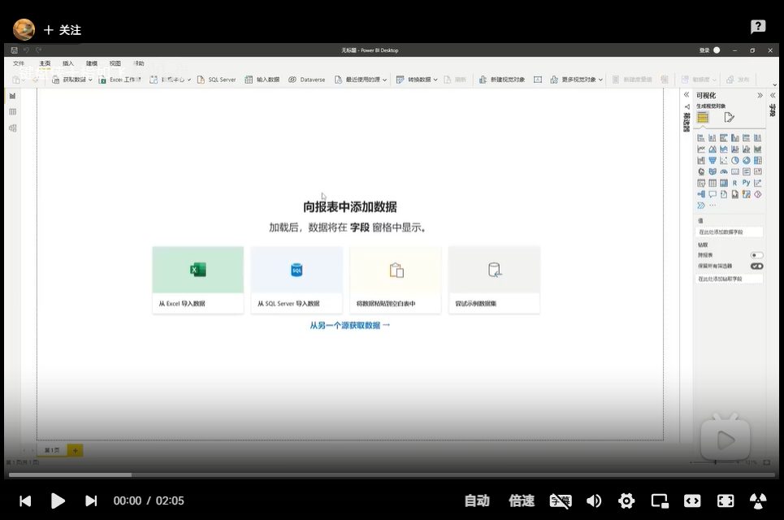

----

**【PowerBI入门教程】06数据编辑**

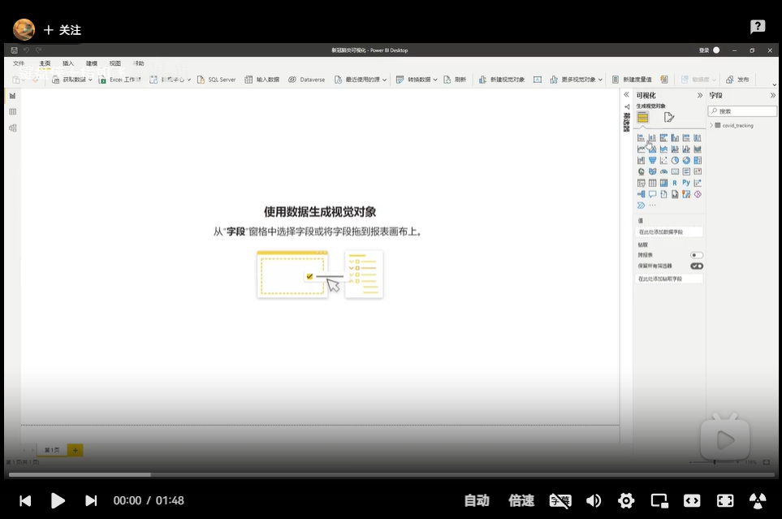

----

**【PowerBI入门教程】07数据预处理**

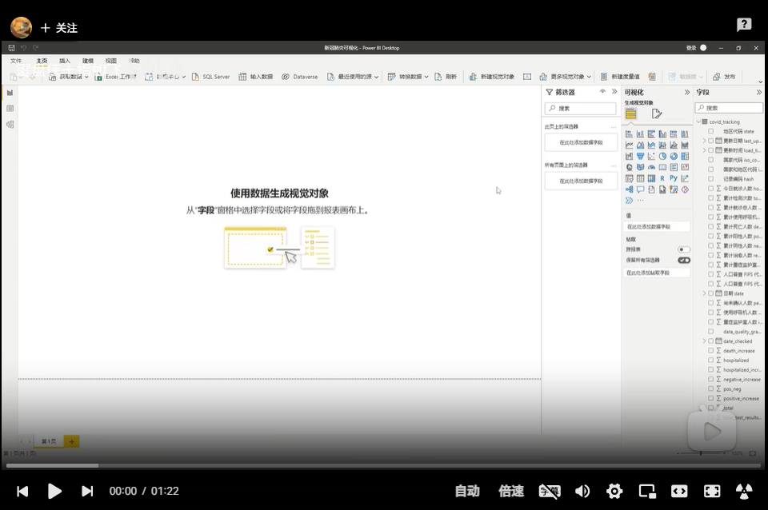

----

**【PowerBI入门教程】08创建表关系**

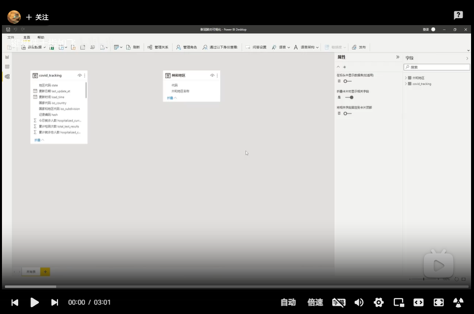

----

**【PowerBI入门教程】09创建日历表**

.. image:: ./_static/PowerBI搭建数据可视化系统封面09.png
    :width: 300px
    :target: https://www.bilibili.com/video/BV1we4y1j7kF/?vd_source=10827ebdd042ef5aac4731b819de92dc
    :alt: 【PowerBI入门教程】09创建日历表

----

**【PowerBI入门教程】10初见DAX表达式**

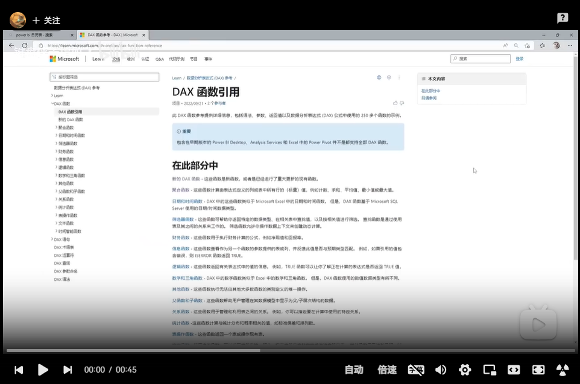

----

**【PowerBI入门教程】11可视化视觉对象**

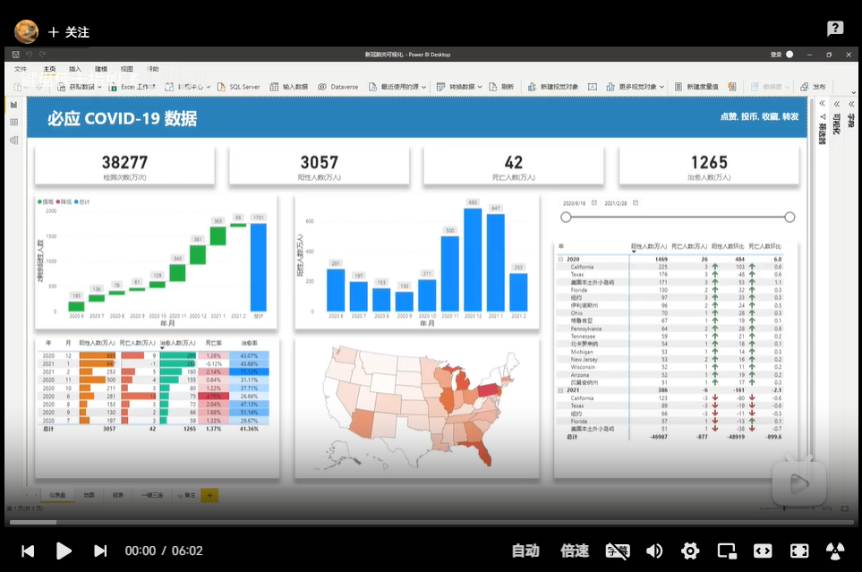

----

**【PowerBI入门教程】12时间切片器**

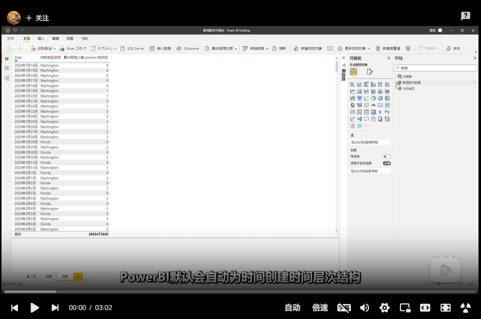

----

**【PowerBI入门教程】13DAX表达式与新建度量值**

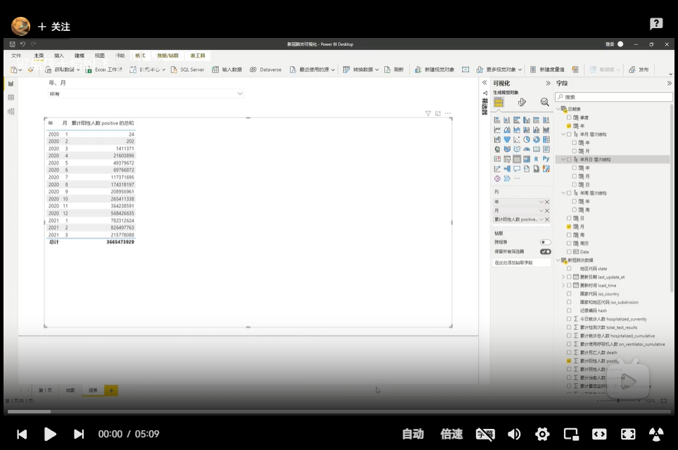

----

**【PowerBI入门教程】14跳转与交互**

.. image:: ./_static/PowerBI搭建数据可视化系统封面14.png
    :width: 300px
    :target: https://www.bilibili.com/video/BV1xV4y1w793/?vd_source=10827ebdd042ef5aac4731b819de92dc
    :alt: 【PowerBI入门教程】14跳转与交互

----

**【PowerBI入门教程】15注册与发布**

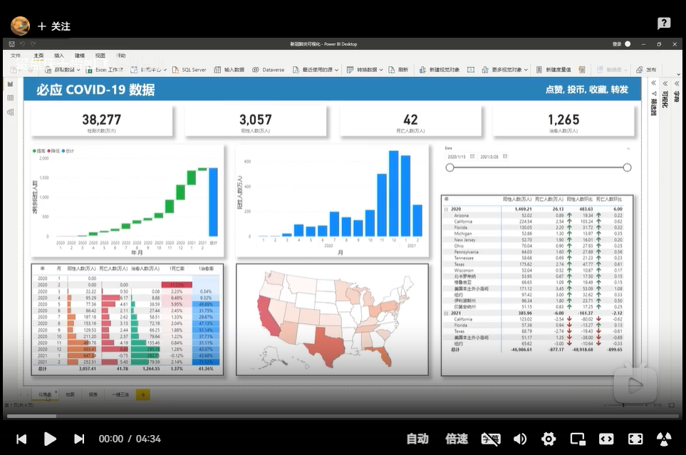

PowerBI业务案例教程
---------------------

**【PowerBI业务案例教程】做一个实时刷新的数据大屏, 超简单**

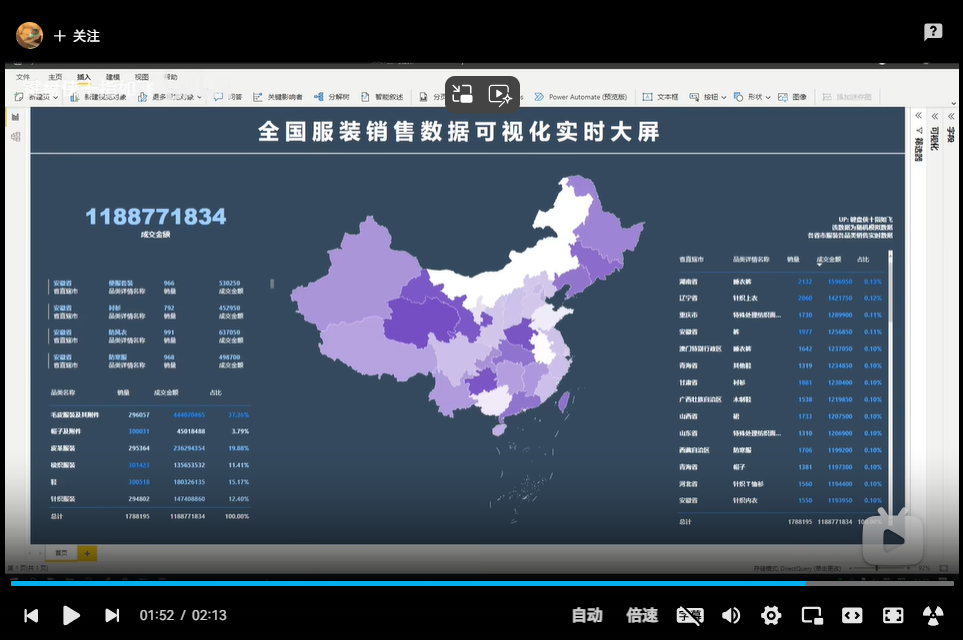

----

**【PowerBI业务案例教程】做一个局域网数据展示平台, 超简单**

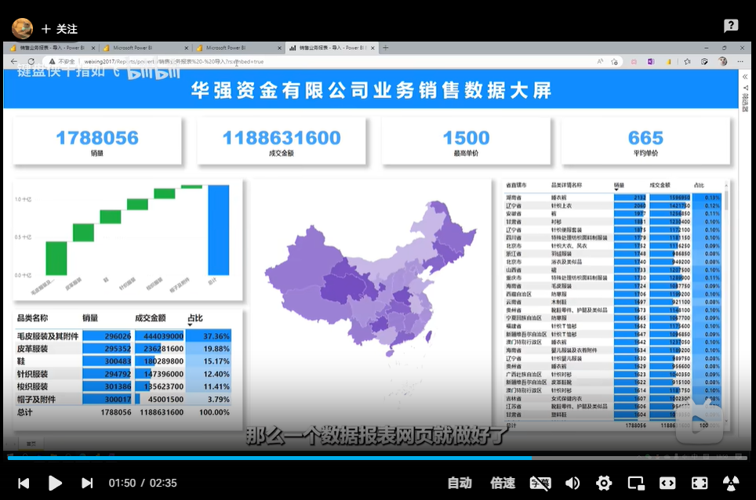

PowerBI技巧合集
---------------------

**【PowerBI小技巧】批量调整列宽**

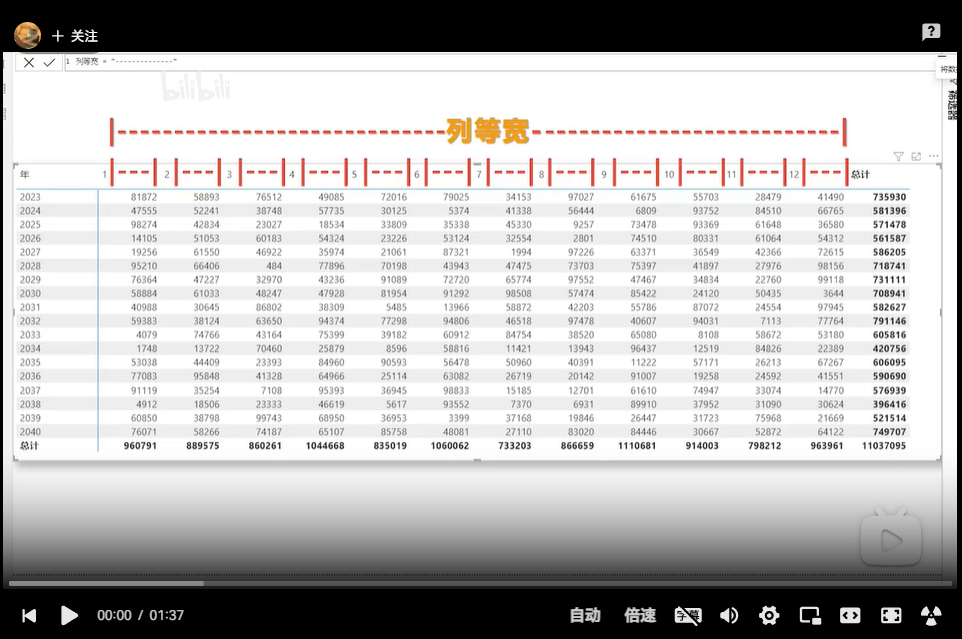
