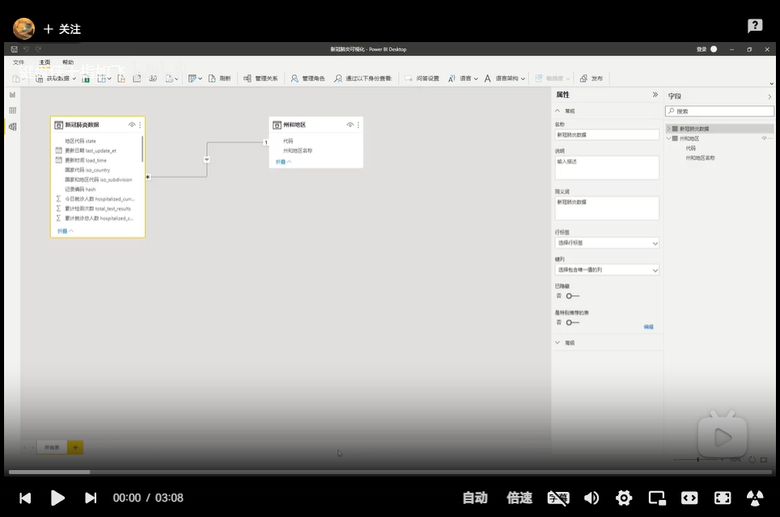
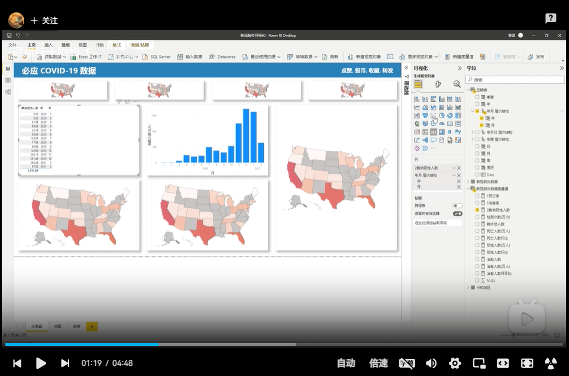

数据可视化教程
=========================

PowerBI数据可视化入门教程
---------------------------------

**【PowerBI入门教程】01前言**

----

**【PowerBI入门教程】02介绍**

----

**【PowerBI入门教程】03软件安装**

----

**【PowerBI入门教程】04软件界面介绍**

----

**【PowerBI入门教程】05数据导入**

----

**【PowerBI入门教程】06数据编辑**

----

**【PowerBI入门教程】07数据预处理**

----

**【PowerBI入门教程】08创建表关系**

----

**【PowerBI入门教程】09创建日历表**

----

**【PowerBI入门教程】10初见DAX表达式**

----

**【PowerBI入门教程】11可视化视觉对象**

----

**【PowerBI入门教程】12时间切片器**

----

**【PowerBI入门教程】13DAX表达式与新建度量值**

----

**【PowerBI入门教程】14跳转与交互**

----

**【PowerBI入门教程】15注册与发布**

PowerBI业务案例教程
---------------------

**【PowerBI业务案例教程】做一个实时刷新的数据大屏, 超简单**

----

**【PowerBI业务案例教程】做一个局域网数据展示平台, 超简单**

PowerBI技巧合集
---------------------

**【PowerBI小技巧】批量调整列宽**

