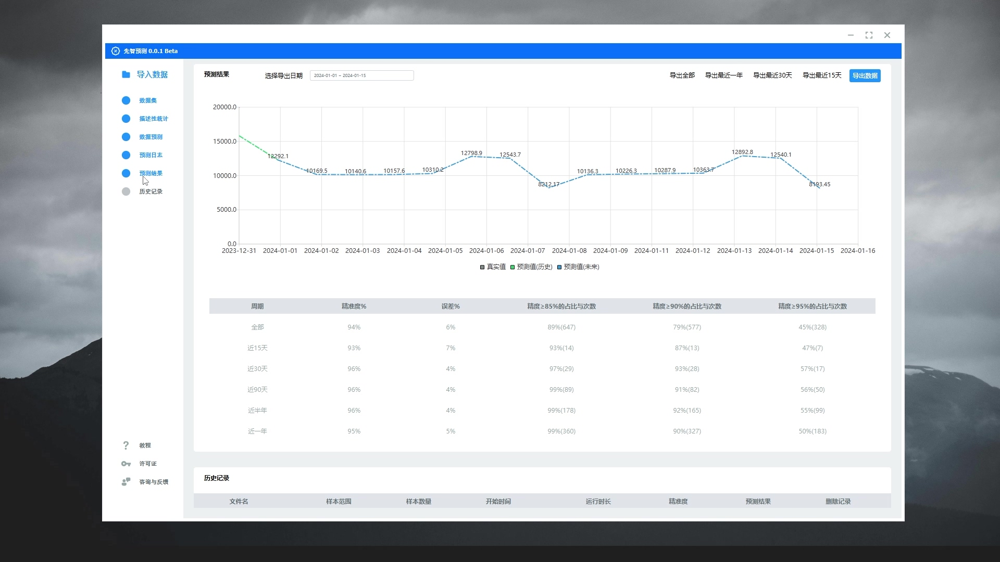

数据预测
==========

如果您在工作中有经营预测的需求,那么推荐试用一下作者开发的这款经营预测软件😀

*软件截图*

软件演示数据使用的都是经过脱敏的真实营业数据,可以看到预测的准确度已经可以达到95%左右

该软件是利用周期性因素、季节性趋势、天气特征、节日节气特征、自然灾害、商圈因素、市场因素、营销因素、政府政策等因素对经营过程中的影响, 使用多种机器学习算法对营业中的各项指标进行数据预测.

所以, 您无需预估各项经营指标, 只需一键导入历史数据, 即可开始预测, 无需任何复杂的操作!

通过预测, 可以使您更科学的安排后续的经营计划, 例如: 生产销售计划、人员排班、库存管理、财务规划等.

这可以使您的各个经营环节更加紧密高效, 从而提高您的市场竞争力.

软件的下载地址是 `www.xianzhiyuce.com <https://www.xianzhiyuce.com/home/>`_

软件首月免费, 推荐大家试用!

